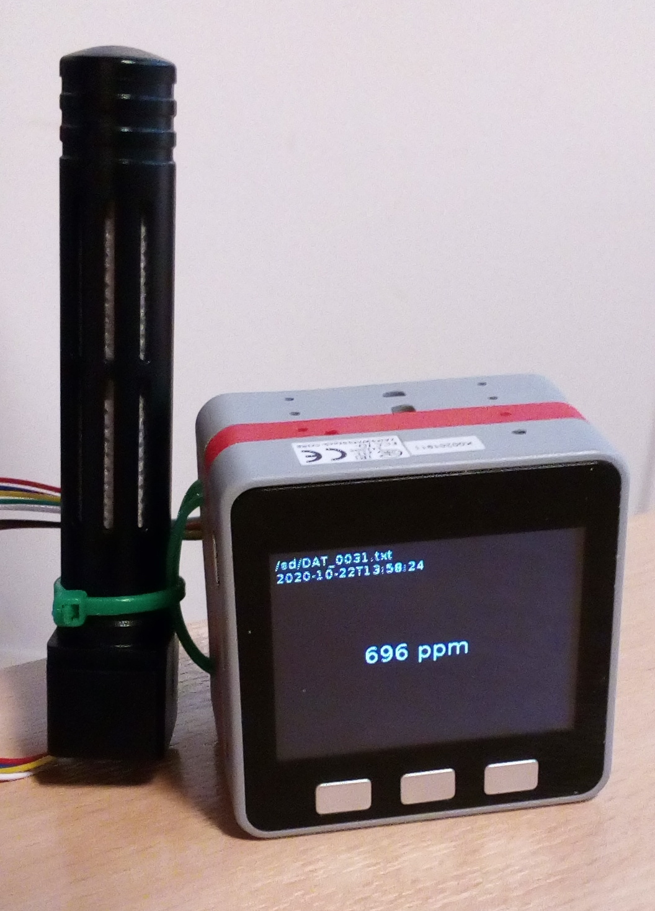

# Projet airSU

## Matériel

* Capteur SEN0220
* M5 Gray
* Batterie M5Stack M002
* Horloge DS3231 avec pile
* Carte microSD (FAT32)
* Chargeur USB + cable rallonge USB

## Branchement

* Capteur SEN0220

    |SEN0220|  fil   | M5stack |
    |-------|--------|---------|
    |   5V  |rouge   |  5V     |
    |  GND  |noir    |  GND    |
    |  TX   |bleu    |GPIO17/T2|
    |  RX   |vert    |GPIO16/R2|

  Remarque : il n'y a pas d'inversion entre RX et TX.

* DS3231

    |DS3231  |M5stack|
    |--------|-------|
    |  -     | GND   |
    |  +     | 5V    |
    |D(data) | G2    |
    |C(clock)| G5    |

Les branchements peuvent être effectués sur un M5 PROTO

## Flasher le firmware

On peut soit utiliser un outil graphique sous windows (Download Flash Tool https://www.espressif.com/en/support/download/other-tools) soit l'outil en ligne de command esptools. 

La ligne de commande pour esptool sera (remplacer /dev/ttuUSB0 par le port COMxx sous windows ): 

    python -m esptool --chip esp32 --port /dev/ttyUSB0 --baud 921600 --before default_reset --after no_reset write_flash -z --flash_mode dio --flash_freq 40m --flash_size detect 0x0 app_output.bin

## Fichiers

Le projet est écrit en utilisant <a href=https://github.com/m5stack/M5Stack_MicroPython>micropython pour le M5 stack</a>.

* lib : librairie pour le capteur et l'horloge RTC
* main : contient le script principale de l'appication
* bin : fichier binaire à installer
* doc : documentation
* notebook : exemple de notebook jupyter pour analyser les données
